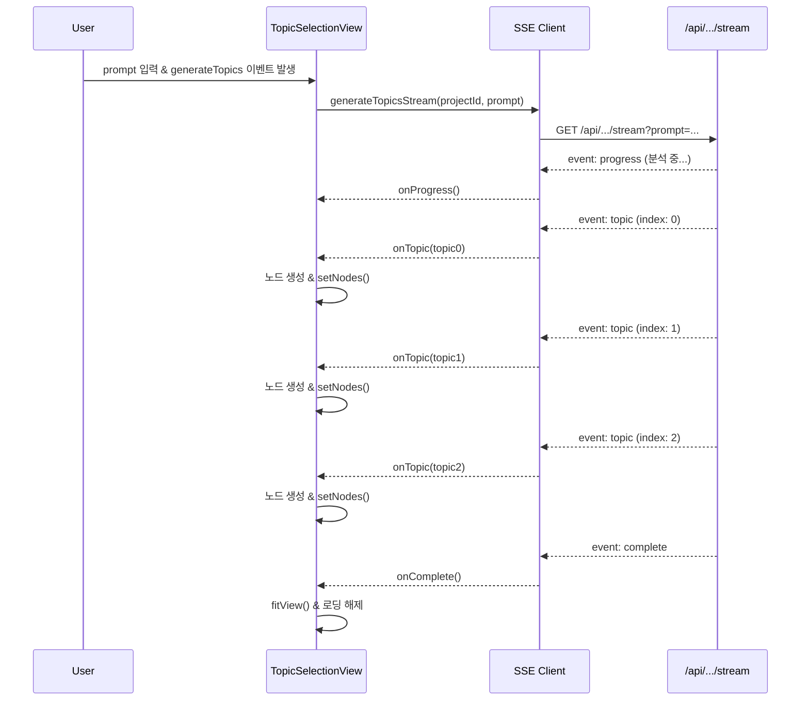

# Topic Selection: SSE 스키마 설계

## 개요

`topic-selection` 페이지에서 prompt 노드에 입력하면, 백엔드가 **SSE(Server-Sent Events)** 방식으로
3개의 주제를 순차적으로 스트리밍하여 프론트엔드에 전달하는 구조입니다.

---

## 1. 프론트엔드 → 백엔드: 주제 생성 요청

### 엔드포인트

```
POST /api/projects/:projectId/topics/generate
```

### Request Body

```typescript
type GenerateTopicsRequest = {
  prompt: string;
  type: 'exploration' | 'refinement'; // 기회탐색형 | 구체화형

  // TODO: 나중 확장용 (지금은 사용 안 함)
  // context?: {
  //   existingTopics?: string[]
  //   researchField?: string
  //   userPreferences?: Record<string, unknown>
  // }
};
```

#### 예시

```json
{
  "prompt": "AI를 활용한 신약 개발 연구",
  "type": "exploration"
}
```

```json
{
  "prompt": "딥러닝 기반 약물-타겟 상호작용 예측",
  "type": "refinement"
}
```

---

## 2. 백엔드 → 프론트엔드: SSE 응답

### 엔드포인트

```
GET /api/projects/:projectId/topics/generate/stream?prompt={prompt}&type={type}
```

또는 POST 요청 후 즉시 SSE 스트림 시작

**Query Parameters:**

- `prompt`: 연구 주제 입력
- `type`: `exploration` (기회탐색형) 또는 `refinement` (구체화형)

### SSE Event Types

#### (1) `topic` 이벤트: 개별 주제 전송

각 주제가 생성될 때마다 발생

```typescript
type TopicStreamEvent = {
  event: 'topic';
  data: TopicData;
};

type TopicData = {
  index: number; // 0, 1, 2 (순서)
  subject: string; // 주제 제목
  description: string; // 주제 설명
  keywords: string[]; // 핵심 키워드 (3-5개)
  necessity: string; // 연구 필요성
  methodology: string; // 연구 방법론
  expectedEffect: string; // 기대 효과
};
```

**SSE 메시지 형식:**

```
event: topic
data: {"index":0,"subject":"대형 건설 현장 컴퓨터 비전 기반 PPE 실시간 감시·경보 시스템 도입 효과","description":"건설업은 산업재해율이 높고...","keywords":["컴퓨터비전","PPE","건설안전","실시간감시","객체탐지"],"necessity":"건설업은 산업재해율이 높고, PPE 미착용이 주요 원인...","methodology":"대형 일반건축 현장 2곳을 선정하여...","expectedEffect":"실험군에서 PPE 준수율 15%p 이상 상승..."}

event: topic
data: {"index":1,"subject":"드론 LiDAR와 BIM 융합 건축물 시공 품질 자동 검사 시스템 개발","description":"건축물 시공 품질 검사는 주로 육안과...","keywords":["LiDAR","BIM","시공품질","드론","포인트클라우드"],"necessity":"건축물 시공 품질 검사는 주로 육안과 샘플링 방식으로...","methodology":"건축물 BIM 모델과 LiDAR 스캔 포인트 클라우드를...","expectedEffect":"품질 검사 시간 50% 이상 단축..."}

event: topic
data: {"index":2,"subject":"강화학습 기반 건설장비 자율운전 및 협업 시뮬레이션 플랫폼","description":"건설 장비 운전사의 부족과 고령화가...","keywords":["강화학습","자율운전","건설장비","시뮬레이션","다중에이전트"],"necessity":"건설 장비 운전사의 부족과 고령화가 심화되고...","methodology":"Unity/Unreal 기반 3D 건설 현장 시뮬레이션 환경을...","expectedEffect":"가상 현장에서 자율주행 정책 사전 검증..."}
```

#### (2) `progress` 이벤트: 진행 상황 (선택 사항)

```typescript
type ProgressEvent = {
  event: 'progress';
  data: {
    stage: 'analyzing' | 'generating' | 'refining';
    message: string;
    percent?: number; // 0-100
  };
};
```

**예시:**

```
event: progress
data: {"stage":"analyzing","message":"프롬프트 분석 중...","percent":10}

event: progress
data: {"stage":"generating","message":"주제 1 생성 중...","percent":40}
```

#### (3) `complete` 이벤트: 스트림 종료

```typescript
type CompleteEvent = {
  event: 'complete';
  data: {
    total: number; // 생성된 주제 개수
    duration: number; // 소요 시간 (ms)
  };
};
```

**예시:**

```
event: complete
data: {"total":3,"duration":2847}
```

#### (4) `error` 이벤트: 에러 발생

```typescript
type ErrorEvent = {
  event: 'error';
  data: {
    code: string;
    message: string;
    details?: unknown;
  };
};
```

**예시:**

```
event: error
data: {"code":"RATE_LIMIT","message":"API 호출 한도 초과","details":{"retryAfter":60}}
```

---

## 3. 프론트엔드: SSE 수신 및 노드 생성

### 이벤트 핸들러 구조 (의사 코드)

```typescript
// features/topic-selection/api/generateTopicsStream.ts
export async function generateTopicsStream(
  projectId: string,
  prompt: string,
  onTopic: (topic: TopicData) => void,
  onProgress?: (progress: ProgressEvent['data']) => void,
  onComplete?: (summary: CompleteEvent['data']) => void,
  onError?: (error: ErrorEvent['data']) => void
) {
  const eventSource = new EventSource(
    `/api/projects/${projectId}/topics/generate/stream?` + new URLSearchParams({ prompt })
  );

  eventSource.addEventListener('topic', (e) => {
    const topic: TopicData = JSON.parse(e.data);
    onTopic(topic);
  });

  eventSource.addEventListener('progress', (e) => {
    if (onProgress) {
      const progress = JSON.parse(e.data);
      onProgress(progress);
    }
  });

  eventSource.addEventListener('complete', (e) => {
    const summary = JSON.parse(e.data);
    if (onComplete) onComplete(summary);
    eventSource.close();
  });

  eventSource.addEventListener('error', (e) => {
    const error = JSON.parse(e.data);
    if (onError) onError(error);
    eventSource.close();
  });

  // 연결 실패 처리
  eventSource.onerror = (e) => {
    if (eventSource.readyState === EventSource.CLOSED) {
      if (onError) {
        onError({
          code: 'CONNECTION_FAILED',
          message: 'SSE 연결 실패',
          details: e,
        });
      }
    }
  };

  return () => eventSource.close(); // cleanup 함수
}
```

### View에서의 사용

```typescript
// views/topic-selection/topic-selection-view.tsx (기존 코드 수정 부분)

useEffect(() => {
  const handler = async (event: Event) => {
    const { prompt } = (event as CustomEvent<{ prompt: string }>).detail;
    const inputNode = nodes.find((n) => n.type === 'prompt');
    if (!inputNode) return;

    // UI 로딩 상태 시작
    setNodes((nds) =>
      nds.map((n) =>
        n.id === inputNode.id ? { ...n, data: { ...n.data, isGenerating: true } } : n
      )
    );

    const baseX = (inputNode.position?.x ?? INPUT_NODE_X) + NODE_OFFSET_X;
    const baseY = inputNode.position?.y ?? INPUT_NODE_Y;
    const newNodesBuffer: Node[] = [];
    const newEdgesBuffer: Edge[] = [];

    const cleanup = await generateTopicsStream(
      projectId,
      prompt,
      // onTopic: 주제 하나씩 수신 시 노드 생성
      (topic) => {
        const nodeId = `topic-${nodeIdRef.current++}`;
        const content: TopicContent = {
          subject: topic.subject,
          description: topic.description,
          keywords: topic.keywords,
          researchQuestions: topic.researchQuestions,
          potentialImpact: topic.potentialImpact,
        };
        const historyId = registerHistory({ nodeId, projectId, keyword: topic.subject });

        const newNode: Node = {
          id: nodeId,
          type: 'topic',
          position: { x: baseX, y: baseY + (topic.index - 1) * NODE_OFFSET_Y },
          data: {
            label: topic.subject,
            content,
            keywords: topic.keywords,
            checked: false,
            pinned: false,
            depth: 1,
            tag: '연구확장',
            historyId,
          },
        };

        const newEdge: Edge = {
          id: `edge-${inputNode.id}-${nodeId}`,
          source: inputNode.id,
          target: nodeId,
          ...defaultEdgeOptions,
        };

        newNodesBuffer.push(newNode);
        newEdgesBuffer.push(newEdge);

        // 실시간으로 노드 추가 (스트리밍 효과)
        setNodes((nds) => [...nds, newNode]);
        setEdges((eds) => [...eds, newEdge]);
      },
      // onProgress (선택)
      (progress) => {
        console.log('[SSE Progress]', progress.message);
      },
      // onComplete
      (summary) => {
        console.log('[SSE Complete]', `${summary.total}개 주제 생성 완료 (${summary.duration}ms)`);
        // 모든 노드에 fitView
        pendingFitViewIdsRef.current = [inputNode.id, ...newNodesBuffer.map((n) => n.id)];
        // 로딩 상태 해제
        setNodes((nds) =>
          nds.map((n) =>
            n.id === inputNode.id ? { ...n, data: { ...n.data, isGenerating: false } } : n
          )
        );
      },
      // onError
      (error) => {
        console.error('[SSE Error]', error);
        alert(`주제 생성 실패: ${error.message}`);
        setNodes((nds) =>
          nds.map((n) =>
            n.id === inputNode.id ? { ...n, data: { ...n.data, isGenerating: false } } : n
          )
        );
      }
    );

    // cleanup 함수 저장 (컴포넌트 unmount 시 연결 종료)
    return cleanup;
  };
  window.addEventListener('generateTopics', handler);
  return () => window.removeEventListener('generateTopics', handler);
}, [nodes, projectId, registerHistory]);
```

---

## 4. 백엔드 구현 가이드 (Node.js/Express 예시)

### Route Handler (SSE 엔드포인트)

```typescript
// src/app/api/projects/[projectId]/topics/generate/stream/route.ts
import { NextRequest } from 'next/server';

export async function GET(request: NextRequest, { params }: { params: { projectId: string } }) {
  const { searchParams } = new URL(request.url);
  const prompt = searchParams.get('prompt');
  const projectId = params.projectId;

  if (!prompt) {
    return new Response('Missing prompt', { status: 400 });
  }

  // SSE 헤더 설정
  const encoder = new TextEncoder();
  const stream = new ReadableStream({
    async start(controller) {
      try {
        // Progress 이벤트 (선택)
        controller.enqueue(
          encoder.encode(
            `event: progress\ndata: ${JSON.stringify({ stage: 'analyzing', message: '프롬프트 분석 중...', percent: 10 })}\n\n`
          )
        );

        // 주제 생성 (실제로는 AI API 호출)
        const topics = await generateTopicsWithAI(prompt, projectId);

        for (let i = 0; i < topics.length; i++) {
          // Progress
          controller.enqueue(
            encoder.encode(
              `event: progress\ndata: ${JSON.stringify({ stage: 'generating', message: `주제 ${i + 1} 생성 중...`, percent: 30 + i * 20 })}\n\n`
            )
          );

          // Topic 이벤트
          const topicData = {
            index: i,
            subject: topics[i].subject,
            description: topics[i].description,
            keywords: topics[i].keywords,
            researchQuestions: topics[i].researchQuestions,
            potentialImpact: topics[i].potentialImpact,
          };
          controller.enqueue(
            encoder.encode(`event: topic\ndata: ${JSON.stringify(topicData)}\n\n`)
          );

          // 스트리밍 느낌을 위한 딜레이 (실제로는 AI 응답 속도에 따라 자연스럽게)
          await new Promise((resolve) => setTimeout(resolve, 300));
        }

        // Complete 이벤트
        controller.enqueue(
          encoder.encode(
            `event: complete\ndata: ${JSON.stringify({ total: topics.length, duration: Date.now() - startTime })}\n\n`
          )
        );

        controller.close();
      } catch (error) {
        // Error 이벤트
        controller.enqueue(
          encoder.encode(
            `event: error\ndata: ${JSON.stringify({ code: 'GENERATION_FAILED', message: error.message })}\n\n`
          )
        );
        controller.close();
      }
    },
  });

  return new Response(stream, {
    headers: {
      'Content-Type': 'text/event-stream',
      'Cache-Control': 'no-cache',
      Connection: 'keep-alive',
    },
  });
}

// AI 주제 생성 함수 (의사 코드)
async function generateTopicsWithAI(prompt: string, projectId: string) {
  // OpenAI, Claude 등 LLM API 호출
  // 또는 내부 로직으로 주제 생성
  return [
    {
      subject: '약물-타겟 상호작용 예측 모델 개발',
      description: 'AI를 활용하여 약물과 생체 타겟 간 상호작용을...',
      keywords: ['딥러닝', '약물설계', '단백질구조'],
      researchQuestions: ['기존 방법 대비 정확도 향상 가능성?'],
      potentialImpact: '신약 개발 기간 단축',
    },
    // ... 2개 더
  ];
}
```

---

## 5. FSD 레이어 배치

```
src/
  entities/
    topic/
      model/types.ts           # TopicData, TopicContent 타입 정의
      api/generateTopics.ts    # SSE 클라이언트 함수
      index.ts

  features/
    topic-selection/
      api/
        generateTopicsStream.ts  # SSE 연결 핵심 로직
      model/
        useTopicGeneration.ts    # 주제 생성 훅 (선택)
      index.ts

  views/
    topic-selection/
      topic-selection-view.tsx   # SSE 이벤트 수신 및 노드 생성 오케스트레이션

  app/
    api/
      projects/
        [projectId]/
          topics/
            generate/
              stream/
                route.ts          # SSE 엔드포인트 (Next.js API Route)
```

---

## 6. 타입 정의 (entities/topic/model/types.ts)

```typescript
// entities/topic/model/types.ts

export type TopicData = {
  index: number;
  subject: string;
  description: string;
  keywords: string[];
  necessity: string;
  methodology: string;
  expectedEffect: string;
};

export type TopicContent = {
  subject: string;
  description: string;
  keywords: string[];
  necessity: string;
  methodology: string;
  expectedEffect: string;
};

export type TopicStreamEvent =
  | { event: 'topic'; data: TopicData }
  | { event: 'progress'; data: { stage: string; message: string; percent?: number } }
  | { event: 'complete'; data: { total: number; duration: number } }
  | { event: 'error'; data: { code: string; message: string; details?: unknown } };
```

---

## 7. 프론트엔드-백엔드 플로우 요약



---

## 8. 체크리스트

- [x] SSE 엔드포인트 정의
- [x] `TopicData` 타입 명세
- [x] 프론트엔드 SSE 클라이언트 (`generateTopicsStream`)
- [x] View에서 실시간 노드 생성 로직
- [x] 백엔드 SSE 응답 구조 (progress, topic, complete, error)
- [x] FSD 레이어별 파일 배치
- [x] 에러 처리 및 연결 종료 로직

---

## 9. 다음 단계 (확장 가능성)

- **캐싱**: 동일한 prompt에 대해 백엔드 캐시 적용
- **재시도**: 네트워크 에러 시 자동 재연결
- **취소**: 사용자가 중간에 생성 취소 가능하도록 AbortController 활용
- **배치 생성**: 여러 prompt를 큐에 쌓아 순차 처리
- **히스토리**: 생성된 주제 자동 저장 및 이력 관리
